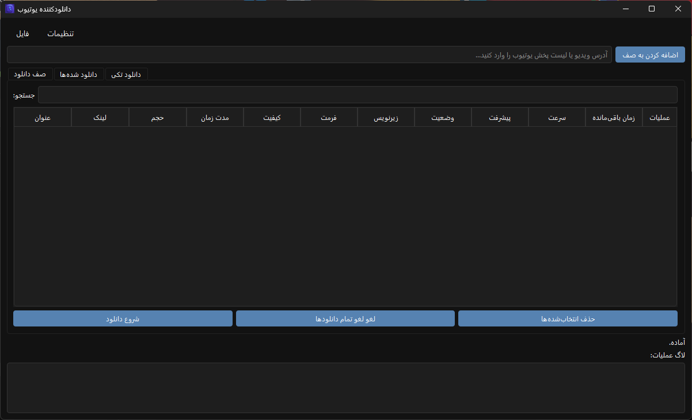

# 🎬 YTDL-GUI (YouTube Downloader with PyQt6)

YTDL-GUI یک برنامه‌ی حرفه‌ای و **رایگان** برای دانلود ویدیو از یوتیوب است که با رابط کاربری گرافیکی (PyQt6) طراحی شده.  
این برنامه از **yt-dlp** و **ffmpeg** استفاده می‌کند و امکانات زیادی برای دانلود ساده، سریع و شخصی‌سازی‌شده ارائه می‌دهد.

---

## ✨ ویژگی‌ها

-   🎥 **انتخاب کیفیت و فرمت خروجی** برای هر ویدیو (MP4, MKV, MP3 و ...)
-   📥 **دانلود تکی یا صفی** (افزودن چندین ویدیو یا پلی‌لیست همزمان)
-   💬 **پشتیبانی از زیرنویس‌ها** (انگلیسی، فارسی و زبان‌های دیگر)
-   🌙 **رابط کاربری مدرن با تم تاریک** و طراحی زیبا
-   📊 **نمایش پیشرفت دانلود** با پروگرس‌بار و سرعت دانلود
-   ⏹️ امکان **لغو دانلود** برای هر آیتم به صورت جداگانه
-   🗂️ **مدیریت و نمایش ویدیوهای دانلودشده** در تب اختصاصی
-   💾 **ذخیره و بازیابی صف دانلود** (حتی بعد از بستن برنامه)
-   🔄 **چک کردن وجود فایل‌های دانلودشده قبلی** (عدم دانلود دوباره)
-   🖼️ دانلود و نمایش **Thumbnail** ویدیوها
-   ⚙️ **دانلود خودکار ffmpeg** اگر نصب نباشد
-   🖱️ **منوی راست‌کلیک پیشرفته** (کپی لینک‌ها، ذخیره اطلاعات، باز کردن محل فایل و ...)

---

## 🚀 نصب و اجرا

### پیش‌نیازها

-   **Python 3.9+**
-   نصب بودن `pip`

### کلون کردن مخزن

```bash
git clone https://github.com/USERNAME/YTDL-GUI.git
cd YTDL-GUI
```

### نصب وابستگی‌ها

**نسخه کامل (همه کتابخانه‌های احتمالی):**

```bash
pip install -r requirement.txt
```

**نسخه سبک (فقط نیازهای اصلی):**

```bash
pip install -r minimal-requirements.txt
```

### اجرای برنامه

```bash
python YTDL-GUI.py
```

---

## 📦 بیلد به صورت EXE (ویندوز)

اگر می‌خواهید یک فایل اجرایی مستقل (بدون نیاز به پایتون) بسازید:

```bash
pyinstaller --onefile --windowed --icon=icon.png YTDL-GUI.py
```

-   فایل خروجی در پوشه `dist/` ساخته می‌شود.
-   می‌توانید آن را به راحتی بین دوستان یا کاربران دیگر توزیع کنید.

---

## 🛠️ تکنولوژی‌های استفاده‌شده

-   [PyQt6](https://pypi.org/project/PyQt6/) → رابط کاربری گرافیکی (GUI)
-   [yt-dlp](https://github.com/yt-dlp/yt-dlp) → دانلود ویدیو از یوتیوب و سایت‌های مشابه
-   [requests](https://pypi.org/project/requests/) → دریافت داده‌ها و دانلود thumbnail
-   [ffmpeg](https://ffmpeg.org/) → پردازش ویدیو و صدا

---

## 📁 ساختار پروژه

```
YTDL-GUI/
│── YTDL-GUI.py              # کد اصلی برنامه
│── requirement.txt          # وابستگی‌های کامل
│── minimal-requirements.txt # وابستگی‌های حداقلی
│── README.md                # مستندات پروژه
│── .gitignore               # فایل‌های غیرضروری برای گیت
│── icon.png                 # آیکون برنامه (اختیاری)
```

---

## ⚙️ تنظیمات قابل تغییر

-   📂 مسیر ذخیره فایل‌ها
-   🎞️ کیفیت ویدیو (144p → 4K)
-   🎧 فرمت خروجی (MP4, MKV, MP3, WebM, …)
-   🔄 تعداد دانلود همزمان
-   🌐 انتخاب پروکسی برای دور زدن محدودیت‌ها
-   💬 فعال/غیرفعال‌سازی دانلود زیرنویس‌ها

---

## 📸 تصاویر (Screenshots)




---

## 🤝 مشارکت (Contributing)

پول‌ریکوئست‌ها و پیشنهادها همیشه خوش‌آمد هستند!  

---

## 📜 لایسنس

این پروژه تحت لایسنس **MIT** منتشر شده است.  
شما آزادید از آن استفاده کنید، تغییر دهید و منتشر کنید.
